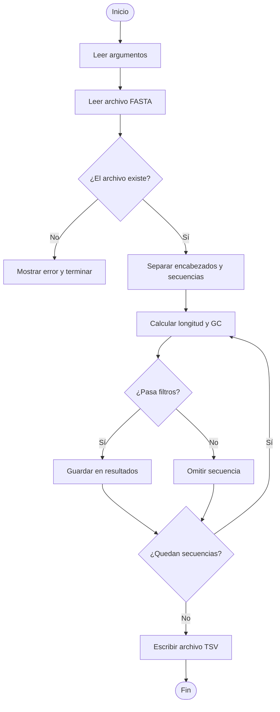

# Guía de Proyecto Final: Analizador de Secuencias FASTA

> **¿Para qué sirve esta guía?**  
> Te lleva paso a paso por la construcción de un programa en Python que analiza archivos FASTA.
> Practicarás todo lo que vimos en el semestre: funciones, docstrings, ciclos, condicionales,
> diccionarios, listas, tuplas, manejo de errores, paso de argumentos, refactorización,
> buenas prácticas de commits y organización de proyectos con `uv`.

---

## ¿Qué vamos a construir?

Un programa de línea de comandos que:

1. Lee un archivo FASTA con secuencias de ADN
2. Calcula estadísticas básicas de cada secuencia (longitud y contenido GC)
3. Filtra secuencias según criterios que el usuario define al correrlo
4. Escribe los resultados en un archivo de texto separado por tabuladores (TSV)

---

## Antes de empezar — lo que necesitas tener instalado

- `uv` (gestor de paquetes y proyectos Python)
- `git`
- Una cuenta en GitHub
- Tu editor de texto favorito (VS Code, nano, etc.)

Verifica que `uv` funciona:

```bash
uv --version
```

---

## Parte 1 — Configuración del proyecto

### 1.1 Crear el proyecto con `uv`

`uv init` crea la estructura básica de un proyecto Python. Ejecuta:

```bash
uv init analizador-fasta
cd analizador-fasta
```

Verás que se crearon estos archivos:

```text
analizador-fasta/
├── pyproject.toml   ← describe el proyecto y sus dependencias
├── README.md        ← vacío por ahora, lo escribiremos al final
└── main.py          ← archivo de ejemplo generado automáticamente
```

> **💡 ¿Qué es `pyproject.toml`?**  
> Es el archivo que le dice a Python (y a `uv`) información sobre el proyecto:
> nombre, versión, dependencias y versión de Python requerida.

Borra el `main.py` generado por `uv` (no lo necesitamos):

```bash
rm main.py
```

Ahora crea las carpetas que usaremos:

```bash
mkdir docs
mkdir src
mkdir data
```

La estructura final del proyecto será:

```text
analizador-fasta/
├── pyproject.toml
├── README.md
├── docs/
│   ├── requisitos.md
│   └── diseño.md
├── src/
│   └── analizador.py
└── data/
    └── ejemplo.fasta
```

Por ahora ya tenemos las carpetas.

---

### 1.2 Inicializar el repositorio Git

Git nos permitirá controlar los cambios del proyecto y subir el código a GitHub.

Primero verifica si ya existe un directorio oculto llamado `.git`:

```bash
ls -lta
```

Si Git ya está inicializado, verás algo similar a esto:

```text
drwxr-xr-x   8 user  staff   256 25 may 20:02 .
drwxr-xr-x   9 user  staff   288 25 may 20:02 .git
-rw-r--r--   1 user  staff     0 25 may 20:02 README.md
-rw-r--r--   1 user  staff   162 25 may 20:02 pyproject.toml
```

Si `.git` no existe, tendremos que inicializar Git.

---

#### a) Desde Visual Studio Code

1. Abre la carpeta `analizador-fasta` en Visual Studio Code.

2. Abre una terminal integrada:

```text
Terminal > New Terminal
```

Y verifica que estes dentro del proyecto con

```bash
pwd
```

sino estas en la carpeta del proyecto muevete al proyecto.


3. Inicializa Git:

```bash
git init
```

4. En el explorador de archivos de VS Code, crea un archivo llamado `.gitignore`.

5. Copia el siguiente contenido:

```gitignore
# Python
__pycache__/
*.py[cod]
*.pyo
.venv/
*.egg-info/

# uv
.python-version
uv.lock

# Editor
.vscode/
.idea/
*.swp

# Resultados generados automáticamente
*.tsv
```

> 💡 Estos archivos y carpetas son generados automáticamente por Python,
> `uv` o el editor. No es necesario subirlos a GitHub.

6. Guarda el archivo.

7. Ve a la pestaña **Source Control** (ícono de ramas en la barra lateral izquierda).

8. Si VS Code muestra el botón **Initialize Repository**, haz clic.

9. En el cuadro de mensaje de commit escribe:

```text
init: estructura inicial del proyecto con uv
```

10. Haz clic en **Commit**.

---

#### b) Desde línea de comandos

Si no puedes hacer el commit desde Visual Studio Code, puedes hacerlo desde la terminal.

Inicializa Git:

```bash
git init
```

Crea el archivo `.gitignore`:

```bash
cat > .gitignore << 'EOF'
# Python
__pycache__/
*.py[cod]
*.pyo
.venv/
*.egg-info/

# uv
.python-version
uv.lock

# Editor
.vscode/
.idea/
*.swp

# Resultados generados automáticamente
*.tsv
EOF
```

Ahora crea el primer commit:

```bash
git add .
git commit -m "init: estructura inicial del proyecto con uv"
```

---

#### 💡 Convención de commits

Usaremos prefijos para que el historial sea más fácil de leer:

| Prefijo | Uso |
|---|---|
| `init:` | Inicio del proyecto o configuración base |
| `docs:` | Documentación |
| `feat:` | Nueva funcionalidad |
| `refactor:` | Reorganización del código |
| `fix:` | Corrección de errores |

---

### 1.3 Publicar el proyecto en GitHub

#### Desde Visual Studio Code (recomendado)

1. Después de hacer el primer commit, abre la pestaña **Source Control**  (ícono de ramas en la barra lateral izquierda).

2. Haz clic en el botón:

```text
Publish Branch
```

o

```text
Publish to GitHub
```

3. Si VS Code lo solicita, inicia sesión con tu cuenta de GitHub.

4. Escribe el nombre del repositorio:

```text
analizador-fasta
```

5. Selecciona si el repositorio será:

- Public
- Private

6. VS Code creará automáticamente el repositorio en GitHub y subirá tu proyecto.

7. Cuando termine, podrás abrir el repositorio directamente desde VS Code o desde tu navegador.


---

## Parte 2 — Documentación

La documentación va **antes** del código. Esto es una buena práctica: pensar y escribir
qué hace el programa antes de ponerse a programarlo evita muchos errores de diseño.

---

### 2.1 Crear `docs/requisitos.md`

Crea el archivo `docs/requisitos.md` con el siguiente contenido:

~~~markdown
# Requisitos del Analizador de Secuencias FASTA

## Descripción del problema

En bioinformática, el formato FASTA es uno de los más usados para almacenar
secuencias de ADN, ARN o proteínas. Cada secuencia tiene dos partes:

1. Una línea de **encabezado** que empieza con `>` y contiene el nombre o
   identificador de la secuencia.
2. Una o más líneas con la **secuencia** de bases (A, T, G, C).

Ejemplo de archivo FASTA:

    >seq1 Homo sapiens BRCA1
    ATGCGATCGATCGATCGCTATCGATCGTAGCTAGCTAGC
    ATCGATCGATCGATCGATCGATCGATCGATCGATCGAT
    >seq2 Mus musculus Actb
    GCGCGCGCGCATCGATCGATCGATCG

En proyectos de genómica es común recibir archivos FASTA con cientos o miles de
secuencias y necesitar filtrarlas por características básicas antes de un análisis
más profundo.

## Objetivo

Construir un programa en Python que procese un archivo FASTA y produzca un reporte
con estadísticas básicas, permitiendo filtrar las secuencias por criterios definidos
por el usuario.

## Requisitos funcionales

1. El programa debe recibir la ruta del archivo FASTA como argumento de línea de comandos.
2. El programa debe recibir la ruta del archivo de salida como argumento.
3. El programa debe calcular para cada secuencia:   
   - Longitud (número de bases)
   - Contenido GC (proporción de bases G y C entre 0 y 1)
4. El programa debe permitir filtrar secuencias por:   
   - Longitud mínima (`--min-len`)
   - Longitud máxima (`--max-len`)
   - Contenido GC mínimo (`--min-gc`)
   - Contenido GC máximo (`--max-gc`)
   Todos los filtros son opcionales.
5. El archivo de salida debe ser un TSV (valores separados por tabulador)
   con columnas: `nombre de secuencia (encabezado)`, `longitud`, `contenido_gc`.
6. El programa debe manejar errores cuando el archivo de entrada no existe.

## Entrada y salida esperadas

**Entrada:**

```
uv run python src/analizador.py -i data/ejemplo.fasta -o resultados.tsv --min-len 50
```

**Salida en consola:**

```
Leyendo archivo: data/ejemplo.fasta
  4 secuencias encontradas
  2 secuencias pasan los filtros
Resultados escritos en 'resultados.tsv'
```

**Archivo `resultados.tsv`:**

```
encabezado	longitud	contenido_gc
seq1 Homo sapiens BRCA1	78	0.4872
seq3 Homo sapiens TP53	130	0.5538
```

~~~

> **💡 ¿Por qué escribir los requisitos antes de programar?**  
> Los requisitos son un contrato: definen exactamente qué debe hacer tu programa.
> Si los tienes escritos, puedes verificar al final si cumpliste con todo.
> 


**Lee detenidamente esto que copiaste para entender el problema. No puedes continuar si no te queda claro de que trata el problema.**

---

### 2.2  Pensar el algoritmo antes de programar

Antes de escribir código, vamos a pensar qué debe hacer el programa paso a paso.

El objetivo no es memorizar código, sino entender la lógica del problema.


#### ¿Qué información tiene un archivo FASTA?

Un archivo FASTA combina dos tipos de líneas:

- líneas de encabezado, que empiezan con `>`
- líneas de secuencia, que contienen bases como `A`, `T`, `G`, `C`

Por ejemplo:

```text
>seq1 Homo sapiens BRCA1
ATGCGATCGATCG
ATCGATCGATCG
>seq2 Mus musculus Actb
GCGCGCATCG
```

La primera pregunta que debe responder nuestro programa es:

> ¿Esta línea es un encabezado o es parte de una secuencia?

En lógica sencilla:

```text
si la línea empieza con ">"
    es un encabezado
si no
    es parte de la secuencia actual
```


####  ¿Qué necesitamos guardar?

Para cada secuencia necesitamos guardar dos cosas:

```text
encabezado
secuencia
```

Por ejemplo:

podriamos guardarlo en una tupla(encabezado, secuencia)

```python
("seq1 Homo sapiens BRCA1", "ATGCGATCGATCGATCGATCG")
```

Como el archivo puede tener muchas secuencias, guardaremos varias de ellas en una lista:

```python
secuencias = [
    ("seq1 Homo sapiens BRCA1", "ATGCGATCGATCGATCGATCG"),
    ("seq2 Mus musculus Actb", "GCGCGCATCG"),
]
```

#### ¿Cuál es la dificultad principal?

La dificultad no es calcular la longitud ni el GC.

La parte más importante es leer correctamente el archivo FASTA, porque una secuencia puede ocupar varias líneas.

Por eso, cuando leemos:

```text
>seq1
ATGC
GCTA
```

la secuencia real es:

```text
ATGCGCTA
```

Entonces necesitamos una variable temporal para ir juntando las líneas de secuencia.


####  Lógica para leer un archivo FASTA

Podemos pensarlo así:

```text
crear una lista vacía llamada secuencias
crear una variable para guardar el encabezado actual
crear una variable para ir acumulando la secuencia actual

para cada línea del archivo:
    limpiar espacios y saltos de línea

    si la línea empieza con ">":
        si ya teníamos una secuencia anterior:
            guardarla en la lista

        guardar el nuevo encabezado
        reiniciar la secuencia actual

    si no empieza con ">":
        agregar esa línea a la secuencia actual

al terminar el archivo:
    guardar la última secuencia
```

La última línea es importante porque el archivo termina sin otro encabezado que nos avise que debemos guardar la última secuencia.


#### ¿Qué estadísticas debemos calcular?

Para cada secuencia necesitamos calcular:

| Estadística | Cómo se calcula |
|---|---|
| Longitud | `len(secuencia)` |
| Contenido GC | `(G + C) / longitud` |

Ejemplo:

```text
Secuencia: ATGCGC
Longitud: 6
G + C: 4
GC: 4 / 6 = 0.6667
```


#### ¿Cómo pensamos los filtros?

Los filtros son condiciones opcionales.

Por ejemplo, si el usuario escribe:

```bash
--min-len 50
```

entonces solo queremos conservar secuencias con longitud mayor o igual a 50.

La lógica general es:

```text
una secuencia pasa si:

    cumple longitud mínima, si el usuario la indicó
    cumple longitud máxima, si el usuario la indicó
    cumple GC mínimo, si el usuario lo indicó
    cumple GC máximo, si el usuario lo indicó
```

Si un filtro no fue indicado por el usuario, simplemente no se aplica.


#### 2.7 Separar el problema en funciones

Ahora que entendemos la lógica, podemos dividir el programa en partes pequeñas.

| Función | Responsabilidad |
|---|---|
| `parsear_argumentos()` | Leer opciones de línea de comandos |
| `leer_fasta(ruta)` | Leer el archivo FASTA y devolver secuencias |
| `calcular_gc(secuencia)` | Calcular el contenido GC |
| `calcular_estadisticas(encabezado, secuencia)` | Calcular longitud y GC |
| `pasa_filtros(stats, args)` | Decidir si una secuencia pasa los filtros |
| `escribir_resultados(stats, ruta)` | Guardar resultados en TSV |
| `main()` | Coordinar todo el programa |

Cada función debe tener una sola responsabilidad. Eso hace que el programa sea más fácil de leer, probar y corregir.


#### Algoritmo completo

Después de pensar cada parte, el algoritmo general queda así:

```text
leer argumentos del usuario

leer archivo FASTA
obtener lista de secuencias

para cada secuencia:
    calcular longitud
    calcular contenido GC

    si pasa los filtros:
        guardarla en los resultados

escribir resultados en archivo TSV
mostrar resumen en pantalla
```

#### Diagrama de flujo


### Crea el archivo `docs/diseño.md`:

Copia lo que esta en este bloque markdown, que describe la solución que hemos analizado. 

**No copies la solución, si aún no lo has entendido. Analiza la solución tantas veces hasta que la comprendas.**


~~~markdown
# Diseño del Analizador de Secuencias FASTA

## Objetivo del diseño

Este documento describe cómo se organizará el programa antes de escribir el código.

La idea principal es dividir el problema en partes pequeñas. Cada parte tendrá una responsabilidad clara.

---

## Algoritmo general

El programa seguirá estos pasos:

1. Leer los argumentos que el usuario escribe en la línea de comandos.
2. Abrir y leer el archivo FASTA.
3. Separar cada secuencia en dos partes:
   - encabezado
   - secuencia completa
4. Calcular estadísticas para cada secuencia:
   - longitud
   - contenido GC
5. Aplicar los filtros indicados por el usuario.
6. Escribir las secuencias que pasaron los filtros en un archivo TSV.
7. Mostrar en consola un resumen del proceso.

---

## Entrada del programa

El programa recibirá:

| Argumento | Significado |
|---|---|
| `-i` / `--input` | Ruta del archivo FASTA de entrada |
| `-o` / `--output` | Ruta del archivo TSV de salida |
| `--min-len` | Longitud mínima permitida |
| `--max-len` | Longitud máxima permitida |
| `--min-gc` | Contenido GC mínimo permitido |
| `--max-gc` | Contenido GC máximo permitido |

Los filtros son opcionales. Si el usuario no indica un filtro, ese filtro no se aplica.

---

## Salida del programa

El programa generará un archivo TSV con tres columnas:

```text
encabezado    longitud    contenido_gc
```

Ejemplo:

```text
seq1 Homo sapiens BRCA1    78    0.4872
seq3 Homo sapiens TP53     130   0.5538
```

---

## Estructura de datos

Primero, las secuencias se almacenarán como una lista de tuplas.

Cada tupla tendrá:

```python
(encabezado, secuencia)
```

Ejemplo:

```python
secuencias = [
    ("seq1 Homo sapiens BRCA1", "ATGCGATCGATCG"),
    ("seq2 Mus musculus Actb", "GCGCGCATCG"),
]
```

Después, las estadísticas se almacenarán como una lista de diccionarios.

Cada diccionario tendrá:

```python
{
    "encabezado": "...",
    "longitud": ...,
    "contenido_gc": ...
}
```

Ejemplo:

```python
estadisticas = [
    {
        "encabezado": "seq1 Homo sapiens BRCA1",
        "longitud": 78,
        "contenido_gc": 0.4872
    }
]
```

---

## Funciones del programa

| Función | Responsabilidad |
|---|---|
| `parsear_argumentos()` | Leer los argumentos de línea de comandos |
| `leer_fasta(ruta)` | Leer el archivo FASTA y devolver una lista de secuencias |
| `calcular_gc(secuencia)` | Calcular el contenido GC de una secuencia |
| `calcular_estadisticas(encabezado, secuencia)` | Calcular longitud y GC de una secuencia |
| `pasa_filtros(stats, args)` | Decidir si una secuencia cumple los filtros |
| `escribir_resultados(stats, ruta)` | Escribir el archivo TSV de salida |
| `main()` | Coordinar todo el flujo del programa |

---

## Responsabilidades de cada función

### `parsear_argumentos()`

Esta función se encargará de leer lo que el usuario escribe en la terminal.

Por ejemplo:

```bash
uv run python src/analizador.py -i data/ejemplo.fasta -o resultados.tsv --min-len 50
```

Debe obtener:

- archivo de entrada
- archivo de salida
- filtros opcionales

---

### `leer_fasta(ruta)`

Esta función leerá el archivo FASTA línea por línea.

Su responsabilidad será identificar:

- cuándo empieza una nueva secuencia
- qué líneas pertenecen a la secuencia actual
- cuándo guardar una secuencia completa

Debe devolver una lista de tuplas:

```python
[
    ("seq1 Homo sapiens BRCA1", "ATGCGATCGATCG"),
    ("seq2 Mus musculus Actb", "GCGCGCATCG"),
]
```

---

### `calcular_gc(secuencia)`

Esta función calculará qué proporción de la secuencia corresponde a bases `G` o `C`.

La fórmula será:

```text
contenido_gc = (número de G + número de C) / longitud de la secuencia
```

---

### `calcular_estadisticas(encabezado, secuencia)`

Esta función reunirá las estadísticas de una secuencia en un diccionario.

Ejemplo:

```python
{
    "encabezado": "seq1 Homo sapiens BRCA1",
    "longitud": 78,
    "contenido_gc": 0.4872
}
```

---

### `pasa_filtros(stats, args)`

Esta función decidirá si una secuencia debe conservarse.

Una secuencia pasa si cumple todos los filtros indicados por el usuario.

Por ejemplo:

```text
si hay --min-len:
    la longitud debe ser mayor o igual al mínimo

si hay --max-len:
    la longitud debe ser menor o igual al máximo

si hay --min-gc:
    el GC debe ser mayor o igual al mínimo

si hay --max-gc:
    el GC debe ser menor o igual al máximo
```

Si un filtro no fue indicado, no se evalúa.

---

### `escribir_resultados(stats, ruta)`

Esta función escribirá el archivo final en formato TSV.

Debe incluir una primera línea con los nombres de las columnas:

```text
encabezado    longitud    contenido_gc
```

---

### `main()`

La función `main()` será la encargada de coordinar todo:

```text
leer argumentos
leer FASTA
calcular estadísticas
filtrar resultados
escribir archivo TSV
mostrar resumen
```

---

## Diagrama de flujo


~~~


#### Commit de documentacion

Haz el commit como `docs: creando requisitos y analisis del problema`


---

## Parte 3 — Construyendo el programa

En esta parte implementaremos el programa paso a paso.

El objetivo no es solamente obtener código que funcione.

La meta principal es:

- comprender la lógica
- entender qué hace cada función
- aprender a dividir problemas
- usar herramientas de IA de manera crítica


### 3.1 Antes de escribir código

No vamos a pedirle a Copilot que genere todo el programa completo.

Trabajaremos una función a la vez.

Antes de implementar cualquier función, debemos responder:

| Pregunta | Objetivo |
|---|---|
| ¿Qué recibe? | Entender las entradas |
| ¿Qué debe hacer? | Definir la responsabilidad |
| ¿Qué devuelve? | Entender la salida |

Por ejemplo:

| Pregunta | Respuesta |
|---|---|
| ¿Qué recibe `calcular_gc(secuencia)`? | Una secuencia como texto |
| ¿Qué hace? | Cuenta bases G y C |
| ¿Qué devuelve? | Un número entre 0 y 1 |


### 3.2 El rol de `main()`

La función `main()` será el orquestador del programa.

Su responsabilidad NO es hacer todos los cálculos.

Su trabajo es coordinar las funciones.

La idea general será:

```text
leer argumentos
leer archivo FASTA
calcular estadísticas
filtrar secuencias
escribir resultados
mostrar resumen
```

Cada tarea importante debe vivir en una función separada.

Esto hace que el programa:

- sea más fácil de leer
- sea más fácil de probar
- sea más fácil de corregir
- tenga responsabilidades claras

Un mal diseño sería:

```text
hacer todo dentro de main()
```

Porque produciría código difícil de mantener.


### 3.3 Construcción incremental

Implementaremos el programa poco a poco.

Orden recomendado:

1. `leer_fasta(ruta)`
2. `calcular_gc(secuencia)`
3. `calcular_estadisticas(encabezado, secuencia)`
4. `pasa_filtros(stats, args)`
5. `escribir_resultados(stats, ruta)`
6. `parsear_argumentos()`
7. `main()`

Cada función debe probarse antes de continuar.


### 3.4 Mini-rutina para cada función

Para cada función seguiremos siempre el mismo proceso.

#### Paso 1 — Entender la lógica

Responder:

- ¿Qué recibe?
- ¿Qué hace?
- ¿Qué devuelve?


#### Paso 2 — Escribir pseudocódigo

Ejemplo:

```text
contar cuántas letras G hay
contar cuántas letras C hay
sumarlas
dividir entre la longitud total
```


#### Paso 3 — Pedir ayuda a Copilot si hace falta

Copilot puede ayudarnos a:

- generar código
- explicar código
- sugerir mejoras
- detectar errores

Pero debemos comprender lo que genera.


#### Paso 4 — Leer y revisar el código

Después de generar código, debemos poder explicar:

- qué hace cada línea
- qué hace cada `if`
- qué hace cada `for`
- qué devuelve `return`
- por qué usamos ciertas funciones


#### Paso 5 — Probar con ejemplos pequeños

Nunca debemos esperar hasta el final para probar.

Probar funciones pequeñas ayuda a detectar errores rápidamente.


#### Paso 6 — Hacer commit

Después de completar una función:

```bash
git commit -m "feat: implementar calcular_gc"
```


### 3.5 Estrategia 1 — Usar comentarios para activar sugerencias

Una manera sencilla de trabajar con Copilot es escribir comentarios describiendo la intención.

Por ejemplo:

```python
# calcular el contenido GC de una secuencia
```

Copilot puede sugerir automáticamente una implementación.

Por ejemplo:

```python
def calcular_gc(secuencia):
    gc = secuencia.count("G") + secuencia.count("C")
    return gc / len(secuencia)
```

### 3.6 Estrategia 2 — Usar modo Ask

Otra opción es abrir el chat de Copilot y activar el modo **Ask**.

En este modo podemos pedir ayuda conceptual antes de generar código.

Ejemplo:

```text
Necesito implementar una función leer_fasta(ruta).
Antes de dar código, ayúdame a pensar la lógica paso a paso.
```

Esto ayuda a enfocarnos primero en el algoritmo.

### 3.7 Estrategia 3 — Usar modo Agent

Después de entender la lógica, podemos activar el modo **Agent**.

Aquí sí podemos pedir implementación.

Ejemplo:

```text
Implementa solo la función leer_fasta(ruta)
seguindo este pseudocódigo:

- abrir archivo
- detectar encabezados
- acumular secuencias
- devolver lista de tuplas

No modifiques otras partes del archivo.
```

Es importante dar instrucciones claras y específicas.


### 3.8 Implementando `calcular_gc(secuencia)`

#### Pensar primero

| Pregunta | Respuesta |
|---|---|
| ¿Qué recibe? | Una secuencia |
| ¿Qué hace? | Cuenta G y C |
| ¿Qué devuelve? | Un número entre 0 y 1 |


#### Pseudocódigo

```text
contar G
contar C
sumar ambas cantidades
dividir entre longitud total
```


#### Implementación

```python
def calcular_gc(secuencia):
    gc = secuencia.count("G") + secuencia.count("C")
    return gc / len(secuencia)
```


#### Explicando funciones de Python

| Función | ¿Para qué sirve? |
|---|---|
| `count("G")` | Cuenta cuántas veces aparece G |
| `len(secuencia)` | Calcula la longitud de la secuencia |
| `return` | Devuelve el resultado de la función |


#### Pensar en errores posibles

¿Qué pasaría si la secuencia estuviera vacía?

```python
len(secuencia) == 0
```

Eso produciría una división entre cero.

Podemos mejorar la función:

```python
def calcular_gc(secuencia):
    if len(secuencia) == 0:
        return 0

    gc = secuencia.count("G") + secuencia.count("C")
    return gc / len(secuencia)
```


### 3.9 Implementando `leer_fasta(ruta)`

Esta función es una de las más importantes del proyecto.

#### Antes de programar

Preguntarnos:

| Pregunta | Respuesta |
|---|---|
| ¿Qué recibe? | Ruta del archivo |
| ¿Qué hace? | Lee secuencias FASTA |
| ¿Qué devuelve? | Lista de tuplas |

---

#### Pseudocódigo

```text
abrir archivo

para cada línea:
    si empieza con ">":
        guardar secuencia anterior
        iniciar nueva secuencia
    si no:
        agregar línea a secuencia actual

guardar última secuencia
```


#### Funciones útiles de Python

| Función | ¿Para qué sirve? |
|---|---|
| `open()` | Abrir archivos |
| `for linea in archivo` | Recorrer líneas |
| `startswith(">")` | Revisar si una línea inicia con `>` |
| `strip()` | Quitar espacios y saltos de línea |
| `append()` | Agregar elementos a una lista |


### 3.10 Leer código críticamente

La IA puede producir código correcto o incorrecto.

Por eso debemos revisar:

- ¿La función realmente hace lo que esperamos?
- ¿Los nombres son claros?
- ¿La lógica coincide con el pseudocódigo?
- ¿Hay casos especiales que no consideró?

Nunca debemos copiar código sin entenderlo.


### 3.11 Probar constantemente

Después de implementar cada función:

- probarla con ejemplos pequeños
- revisar resultados
- imprimir variables si hace falta
- corregir errores antes de continuar

Ejemplo:

```python
print(calcular_gc("ATGCGC"))
```


### 3.12 implementar el resto de las funciones

Ya revisamos con más detalle `leer_fasta(ruta)` y `calcular_gc(secuencia)`.  
Ahora intenta implementar el resto de las funciones siguiendo la misma lógica.

Antes de programar, completa mentalmente esta tabla:

| Función | Entrada | ¿Qué hace? | Salida |
|---|---|---|---|
| `calcular_estadisticas(encabezado, secuencia)` | Un encabezado y una secuencia | Calcula la longitud y el contenido GC | Un diccionario con encabezado, longitud y contenido GC |
| `pasa_filtros(stats, args)` | Un diccionario de estadísticas y los argumentos del usuario | Revisa si la secuencia cumple los filtros indicados | `True` si pasa, `False` si no pasa |
| `escribir_resultados(stats, ruta)` | Lista de estadísticas filtradas y ruta de salida | Escribe un archivo TSV con los resultados | No devuelve nada |
| `parsear_argumentos()` | Argumentos escritos en la terminal | Define y lee opciones como `-i`, `-o`, `--min-len`, etc. | Un objeto `args` con los valores del usuario |
| `main()` | No recibe argumentos directamente | Coordina todo el programa llamando a las demás funciones | No devuelve nada |

Intenta implementar cada función una por una.

Recuerda seguir esta mini-rutina:

1. Escribe qué debe hacer la función.
2. Escribe pseudocódigo.
3. Implementa una primera versión.
4. Pruébala con un ejemplo pequeño.
5. Si tienes dudas, usa Copilot en modo **Ask** antes de pedir código.
6. Cuando entiendas la lógica, puedes usar modo **Agent** para ayudarte a completar la función.


### 3.13 Integrar todo en `main()`

Cuando todas las funciones estén listas, `main()` conectará todo.

Ejemplo conceptual:

```python
args = parsear_argumentos()
secuencias = leer_fasta(args.input)

for encabezado, secuencia in secuencias:
    stats = calcular_estadisticas(encabezado, secuencia)

    if pasa_filtros(stats, args):
        resultados.append(stats)

escribir_resultados(resultados, args.output)
```

La idea importante es:

> `main()` coordina.
>
> Las demás funciones hacen el trabajo específico.

Ese es uno de los principios más importantes de diseño de software.


> **💡 ¿Qué significa `if __name__ == '__main__'`?**  
> Esta condición es `True` solo cuando ejecutas el archivo directamente
> (`python src/analizador.py`). Si alguien importa tu módulo desde otro script
> (`import analizador`), esta línea **no** se ejecuta. Es la forma correcta de
> separar el código ejecutable del código reutilizable.

> **💡 ¿Por qué una función `main()`?**  
> Poner toda la lógica principal en `main()` tiene varias ventajas:
> - Queda claro cuál es el "punto de entrada" del programa.
> - El código dentro de `main()` puede probarse de manera aislada.
> - Las variables dentro de `main()` son locales, no globales (más seguro).


---

## Parte 4 — README para el usuario

El `README.md` en la raíz del proyecto es lo primero que ve alguien que llega
a tu repositorio en GitHub. Debe explicar **qué hace el programa y cómo usarlo**,
no cómo está construido internamente.

Edita el `README.md` que creó `uv` y reemplaza su contenido con:

```markdown
# Analizador de Secuencias FASTA

Programa de línea de comandos que calcula estadísticas básicas
(longitud y contenido GC) para secuencias de ADN en formato FASTA,
con opción de filtrar por criterios definidos por el usuario.

## Instalación

Clona el repositorio e instala el entorno con `uv`:

    git clone https://github.com/TU_USUARIO/analizador-fasta.git
    cd analizador-fasta
    uv sync

## Uso

Sintaxis general:

    uv run python src/analizador.py -i ARCHIVO_FASTA -o ARCHIVO_SALIDA [opciones]

### Ejemplos

Analizar todas las secuencias sin filtros:

    uv run python src/analizador.py -i data/ejemplo.fasta -o resultados.tsv

Filtrar secuencias de al menos 100 bases:

    uv run python src/analizador.py -i data/ejemplo.fasta -o resultados.tsv --min-len 100

Filtrar por longitud y contenido GC:

    uv run python src/analizador.py -i data/ejemplo.fasta -o resultados.tsv \
        --min-len 50 --min-gc 0.4 --max-gc 0.6

Ver todas las opciones disponibles:

    uv run python src/analizador.py --help

## Argumentos

| Argumento    | Tipo  | Requerido | Descripción                              |
|--------------|-------|-----------|------------------------------------------|
| `-i, --input`  | str | Sí        | Ruta al archivo FASTA de entrada         |
| `-o, --output` | str | Sí        | Ruta al archivo TSV de salida            |
| `--min-len`  | int   | No        | Longitud mínima de secuencia (en bases)  |
| `--max-len`  | int   | No        | Longitud máxima de secuencia (en bases)  |
| `--min-gc`   | float | No        | Contenido GC mínimo (entre 0.0 y 1.0)   |
| `--max-gc`   | float | No        | Contenido GC máximo (entre 0.0 y 1.0)   |

## Formato de salida

El archivo de salida es un TSV (tab-separated values) con tres columnas:

    encabezado          longitud    contenido_gc
    seq1 Homo sapiens   130         0.4872
    seq3 Homo sapiens   200         0.5538

## Documentación técnica

- [Requisitos del programa](docs/requisitos.md)
- [Diseño y diagrama de flujo](docs/diseño.md)
```

Haz commit:

```bash
git add README.md
git commit -m "doc: agregar guía de usuario en README"
git push
```

---

## Parte 5 — Prueba final

Con el archivo `data/ejemplo.fasta` que está en el repositorio, prueba distintos
escenarios:

**Sin filtros:**

```bash
uv run python src/analizador.py -i data/ejemplo.fasta -o resultados.tsv
```

**Con filtro de longitud mínima:**

```bash
uv run python src/analizador.py -i data/ejemplo.fasta -o resultados.tsv --min-len 50
```

**Con filtro de GC:**

```bash
uv run python src/analizador.py -i data/ejemplo.fasta -o resultados.tsv --min-gc 0.4 --max-gc 0.6
```

**Prueba de error — archivo que no existe:**

```bash
uv run python src/analizador.py -i data/no_existe.fasta -o resultados.tsv
```

Debes ver el mensaje de error sin que Python lance una excepción fea.

Si encuentras un error y lo corriges, el commit es:

```bash
git add src/analizador.py
git commit -m "fix: describir aquí qué error corregiste"
git push
```

---

## Resumen del historial de commits esperado

Al final del proyecto, tu `git log --oneline` debería verse así:

```
a1b2c3d doc: agregar guía de usuario en README
e4f5g6h refactor: agregar main() como orquestador del flujo
i7j8k9l feat: escribir resultados TSV y parsear argumentos
m1n2o3p feat: filtrar secuencias por longitud y contenido GC
q4r5s6t feat: calcular longitud y contenido GC por secuencia
u7v8w9x feat: leer y parsear archivo FASTA
y1z2a3b doc: agregar requisitos y diseño del analizador
c4d5e6f init: estructura inicial del proyecto con uv
```

Un historial así cuenta una historia clara: qué se hizo, en qué orden y por qué.

---

## Checklist de entrega

Antes de la demostración, verifica que tienes todo esto:

- [ ] Repositorio en GitHub con el nombre `analizador-fasta`
- [ ] `docs/requisitos.md` con descripción del problema y requisitos funcionales
- [ ] `docs/diseño.md` con el algoritmo y el diagrama Mermaid
- [ ] `README.md` con instrucciones de uso claras
- [ ] `src/analizador.py` con todas las funciones documentadas con docstrings
- [ ] `data/ejemplo.fasta` con secuencias de prueba
- [ ] Historial de commits con los prefijos correctos (`init:`, `doc:`, `feat:`, `refactor:`, `fix:`)
- [ ] El programa corre sin errores con y sin filtros
- [ ] El programa muestra un mensaje de error claro si el archivo no existe
