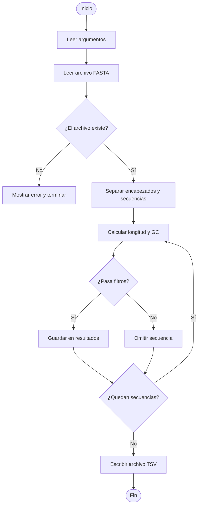

# Diseño del Analizador de Secuencias FASTA

## Objetivo del diseño

Este documento describe cómo se organizará el programa antes de escribir el código.

La idea principal es dividir el problema en partes pequeñas. Cada parte tendrá una responsabilidad clara.

---

## Algoritmo general

El programa seguirá estos pasos:

1. Leer los argumentos que el usuario escribe en la línea de comandos.
2. Abrir y leer el archivo FASTA.
3. Separar cada secuencia en dos partes:
   - encabezado
   - secuencia completa
4. Calcular estadísticas para cada secuencia:
   - longitud
   - contenido GC
5. Aplicar los filtros indicados por el usuario.
6. Escribir las secuencias que pasaron los filtros en un archivo TSV.
7. Mostrar en consola un resumen del proceso.

---

## Entrada del programa

El programa recibirá:

| Argumento | Significado |
|---|---|
| `-i` / `--input` | Ruta del archivo FASTA de entrada |
| `-o` / `--output` | Ruta del archivo TSV de salida |
| `--min-len` | Longitud mínima permitida |
| `--max-len` | Longitud máxima permitida |
| `--min-gc` | Contenido GC mínimo permitido |
| `--max-gc` | Contenido GC máximo permitido |

Los filtros son opcionales. Si el usuario no indica un filtro, ese filtro no se aplica.

---

## Salida del programa

El programa generará un archivo TSV con tres columnas:

```text
encabezado    longitud    contenido_gc
```

Ejemplo:

```text
seq1 Homo sapiens BRCA1    78    0.4872
seq3 Homo sapiens TP53     130   0.5538
```

---

## Estructura de datos

Primero, las secuencias se almacenarán como una lista de tuplas.

Cada tupla tendrá:

```python
(encabezado, secuencia)
```

Ejemplo:

```python
secuencias = [
    ("seq1 Homo sapiens BRCA1", "ATGCGATCGATCG"),
    ("seq2 Mus musculus Actb", "GCGCGCATCG"),
]
```

Después, las estadísticas se almacenarán como una lista de diccionarios.

Cada diccionario tendrá:

```python
{
    "encabezado": "...",
    "longitud": ...,
    "contenido_gc": ...
}
```

Ejemplo:

```python
estadisticas = [
    {
        "encabezado": "seq1 Homo sapiens BRCA1",
        "longitud": 78,
        "contenido_gc": 0.4872
    }
]
```

---

## Funciones del programa

| Función | Responsabilidad |
|---|---|
| `parsear_argumentos()` | Leer los argumentos de línea de comandos |
| `leer_fasta(ruta)` | Leer el archivo FASTA y devolver una lista de secuencias |
| `calcular_gc(secuencia)` | Calcular el contenido GC de una secuencia |
| `calcular_estadisticas(encabezado, secuencia)` | Calcular longitud y GC de una secuencia |
| `pasa_filtros(stats, args)` | Decidir si una secuencia cumple los filtros |
| `escribir_resultados(stats, ruta)` | Escribir el archivo TSV de salida |
| `main()` | Coordinar todo el flujo del programa |

---

## Responsabilidades de cada función

### `parsear_argumentos()`

Esta función se encargará de leer lo que el usuario escribe en la terminal.

Por ejemplo:

```bash
uv run python src/analizador.py -i data/ejemplo.fasta -o resultados.tsv --min-len 50
```

Debe obtener:

- archivo de entrada
- archivo de salida
- filtros opcionales

---

### `leer_fasta(ruta)`

Esta función leerá el archivo FASTA línea por línea.

Su responsabilidad será identificar:

- cuándo empieza una nueva secuencia
- qué líneas pertenecen a la secuencia actual
- cuándo guardar una secuencia completa

Debe devolver una lista de tuplas:

```python
[
    ("seq1 Homo sapiens BRCA1", "ATGCGATCGATCG"),
    ("seq2 Mus musculus Actb", "GCGCGCATCG"),
]
```

---

### `calcular_gc(secuencia)`

Esta función calculará qué proporción de la secuencia corresponde a bases `G` o `C`.

La fórmula será:

```text
contenido_gc = (número de G + número de C) / longitud de la secuencia
```

---

### `calcular_estadisticas(encabezado, secuencia)`

Esta función reunirá las estadísticas de una secuencia en un diccionario.

Ejemplo:

```python
{
    "encabezado": "seq1 Homo sapiens BRCA1",
    "longitud": 78,
    "contenido_gc": 0.4872
}
```

---

### `pasa_filtros(stats, args)`

Esta función decidirá si una secuencia debe conservarse.

Una secuencia pasa si cumple todos los filtros indicados por el usuario.

Por ejemplo:

```text
si hay --min-len:
    la longitud debe ser mayor o igual al mínimo

si hay --max-len:
    la longitud debe ser menor o igual al máximo

si hay --min-gc:
    el GC debe ser mayor o igual al mínimo

si hay --max-gc:
    el GC debe ser menor o igual al máximo
```

Si un filtro no fue indicado, no se evalúa.

---

### `escribir_resultados(stats, ruta)`

Esta función escribirá el archivo final en formato TSV.

Debe incluir una primera línea con los nombres de las columnas:

```text
encabezado    longitud    contenido_gc
```

---

### `main()`

La función `main()` será la encargada de coordinar todo:

```text
leer argumentos
leer FASTA
calcular estadísticas
filtrar resultados
escribir archivo TSV
mostrar resumen
```

---

## Diagrama de flujo

